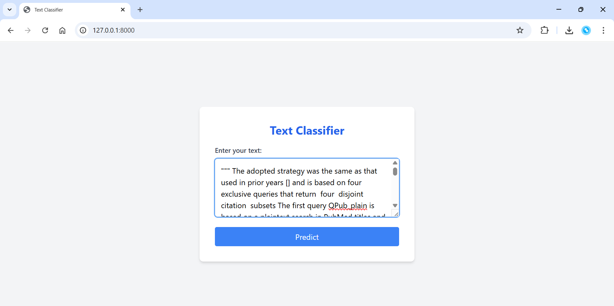
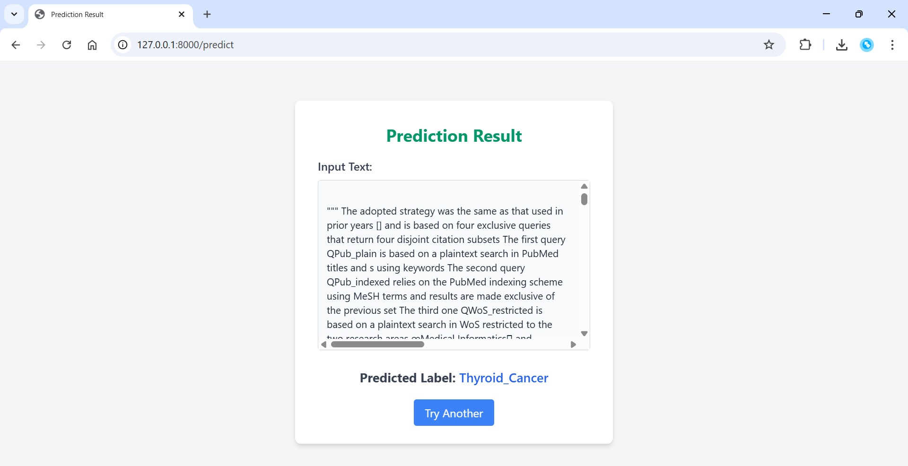

# ClassiCancer

This project leverages **NLP** and a **TensorFlow** model to classify medical text into different **cancer** types. 

It includes a **FastAPI** service for real-time predictions.

## 🎯 Motivation

I built **ClassiCancer** to explore the power of **Natural Language Processing (NLP)** and **deep learning** in medical applications. 

Given the complexity and volume of unstructured clinical text, manually identifying cancer types is time-consuming and error-prone. 

**ClassiCancer** provides an automated solution for classifying cancer types from medical text, supporting faster and more reliable decision-making in healthcare.

## 🚀 Quick Start

Follow the steps below to set up and run **ClassiCancer** on your local machine:

### 1. Clone the Repository

```bash
git clone git@github.com:MDAAMIRAHMED/ClassiCancer.git
cd ClassiCancer
```

### 2. Set up the virtual environment

```bash
python -m venv venv
source venv/bin/activate   # On Windows: venv\Scripts\activate
pip install -r requirements.txt
```

### 3. Download the dataset
Download the dataset from the following link and place it in the project root folder:

📦 [Download Dataset](https://www.kaggle.com/datasets/falgunipatel19/biomedical-text-publication-classification/data)

### 4. Prepare the model (if not already saved)
```bash
jupyter notebook CancerTextClassifier.ipynb
```

This will train the model and save:

1. text_rnn_model.h5

2. tokenizer.pkl

3. label_encoder.pkl

These will be saved in the app/ folder.

### 5. Run the FastAPI app

```bash
uvicorn app.main:app --reload
```
Visit http://127.0.0.1:8000 to access the UI.

## 📁 Folder Structure

CancerTextClassifier_FastAPI/

├── app/

│   ├── main.py

│   ├── tokenizer.pkl

│   ├── label_encoder.pkl

│   ├── text_rnn_model.h5

│   └── templates/

│   ├──   ├── index.html

│   ├──   └── result.html

├── CancerTextClassifier.ipynb

├── requirements.txt

├── cancer.csv(dataset)

└── venv/

## 📸 UI Screenshots

### 🔹 Home Page


### 🔹 Prediction Result Page

